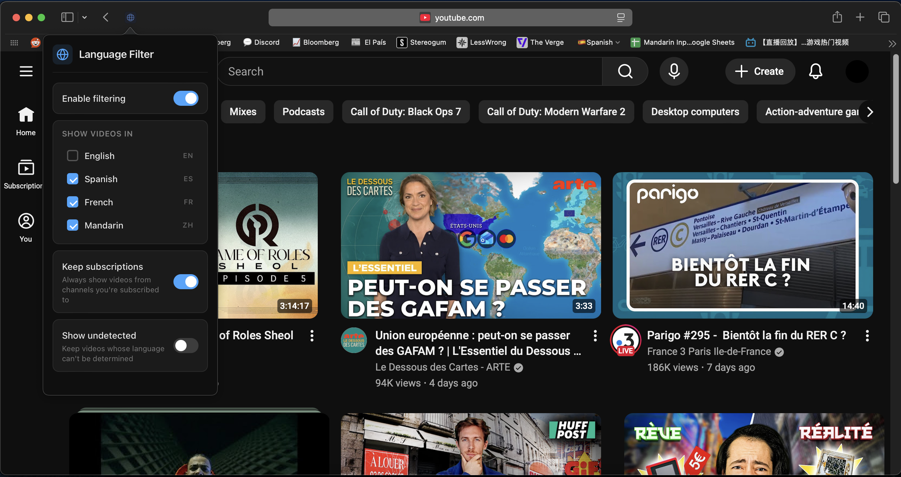

# YouTube Language Filter

Safari extension that hides YouTube videos not in your chosen language. Detects language from video titles using script analysis (CJK, kana, hangul) and function-word matching for Latin-script languages, then filters your feed in real time.

## Features

**Filtering**
- Real-time language detection from video titles as YouTube loads
- Multi-language selection — show videos in one or more languages at once
- Subscription bypass — always show videos from channels you're subscribed to
- Unknown language handling — choose to show or hide videos with undetectable language
- Smooth fade-in for processed cards, instant collapse for hidden ones

**Language Detection**
- CJK ideograph detection for Chinese with Japanese/Korean disambiguation
- Function-word matching for English, Spanish, and French
- Keyword and accent-based boosting for ambiguous titles (e.g. "video oficial", accented characters)
- Language-learning context detection (recognizes titles about learning a language vs. in that language)
- Multi-source title extraction — reads from title nodes, attributes, aria-labels, and link text

**Popup**
- Dark theme UI with toggle switches and language checkboxes
- Live save — changes apply instantly to all open YouTube tabs
- Status feedback for save confirmation and error states
- Disabled state when filtering is turned off

## How It Works

1. **Content script** runs on all YouTube pages, observing the DOM via `MutationObserver` for new video cards as they load
2. **Title extraction** collects candidate text from multiple DOM sources (`#video-title`, link text, `aria-label`, `title` attributes) and scores them to find the best title
3. **Language detection** analyzes the title through a pipeline:
   - Script detection (CJK ideographs → Chinese, kana → Japanese, hangul → Korean)
   - Keyword matching for language-specific strong/weak signals with learning-context awareness
   - Function-word frequency analysis across English, Spanish, and French word lists
4. **Filtering** hides or shows each video card based on the detected language and user preferences
5. **Background service worker** syncs configuration changes to all open YouTube tabs via `runtime.sendMessage`

## Supported Languages

| Language | Detection Method |
|----------|-----------------|
| English | Function-word matching |
| Spanish | Function words + keywords + accent detection |
| French | Function words + keywords + accent detection |
| Mandarin | CJK ideograph ratio + keyword matching |

## Install

1. Open the Xcode project in `YouTubeLanguageFilter/`
2. Build and run the app
3. Enable the extension in Safari → Settings → Extensions

## Tech Stack

- **Extension**: Manifest V3, vanilla JS
- **Language detection**: Custom function-word and script-analysis engine (no external APIs)
- **UI**: CSS-only dark theme with custom toggle switches and checkboxes
- **Safari**: Xcode project with companion macOS app
- **Testing**: Playwright

## License

MIT
